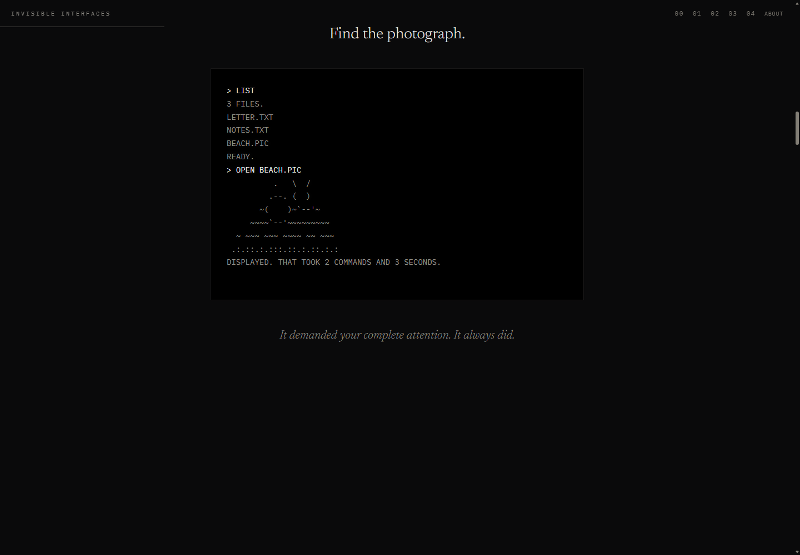
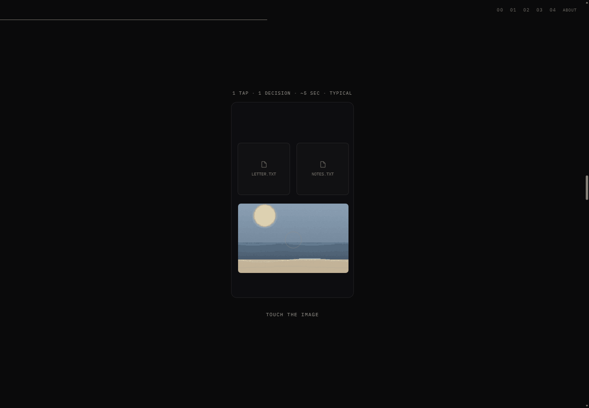
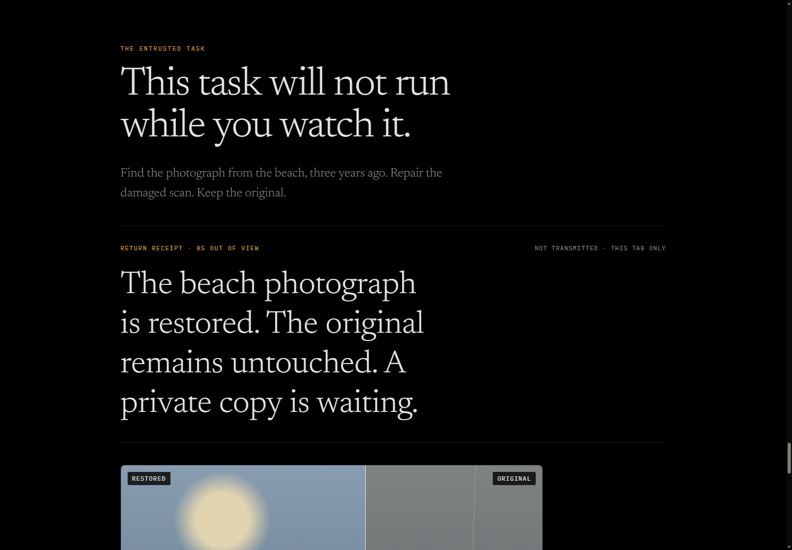

# Invisible Interfaces

A measured interactive essay about attention leaving the interface—and what an invisible system owes us when we return.

One photograph travels through five relationships with computing:

1. attention is demanded;
2. operation becomes pointing, touching, asking, and prediction;
3. software begins acting before it is asked;
4. the task is entrusted;
5. absence returns as a tangible result, an authority boundary, and a reversible decision.

The signature interaction is causal. After the visitor entrusts the restoration, work advances only while the tab is hidden. Returning early pauses the remaining work. Returning after completion reveals an original/restored comparison, a bounded work receipt, the system’s limits, and the visitor’s own local attention receipt.

## Release frames

## Privacy

No analytics or remote agent is used. The attention ledger is stored only in session storage, returned to the visitor at the end, never transmitted, and deleted when the tab closes.

## Run

    npm install
    npm run dev

Production verification:

    npm run build

## Test

The browser walkthroughs live in tests/e2e and cover the opening, terminal, morph, anticipation scene, entrusted absence, keyboard navigation, mobile layout, reduced motion, copy integrity, and the About/404 routes.

See CASESTUDY.md for the design argument and VISUAL_SYSTEM.md for the current exhibition system.